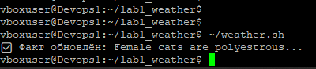
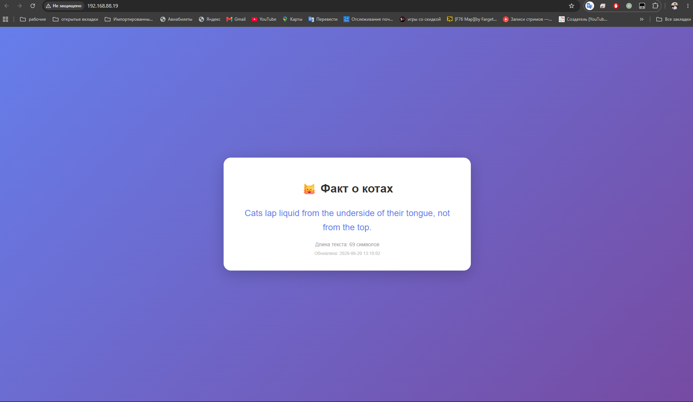
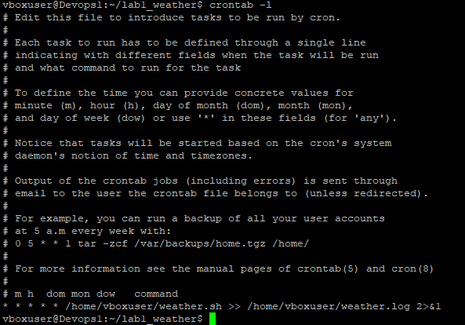
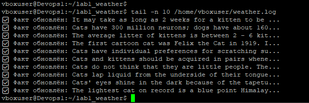

# Лабораторная работа №1: Скрипт запроса данных из JSON API

## Описание
Bash скрипт, который получает данные из JSON API и отображает их на вебстранице через nginx.

## Почему не погода?
API `wttr.in` и `open-meteo.com` не работают. 
Согласно заданию, допускается использовать любой другой ресурс, отдающий данные в формате JSON.
Выбран `catfact.ninja` стабильно работающий API с простым JSON ответом.

## Возможности
- Получает случайный факт о котах через `curl`
- Парсит JSON с помощью `jq`
- Автоматически обновляет страницу каждую минуту через `cron`
- Отдаёт данные через `nginx`

## Структура проекта
```text
lab1_weather/
├── weather.sh          # Основной bash-скрипт
├── README.md           # Описание проекта
└── screenshots/        # Скриншоты работы
```

## Установка и настройка

### 1. Установка необходимых пакетов
```bash
sudo apt update
sudo apt install -y nginx jq curl
```

### 2. Настройка прав доступа
```bash
sudo chown -R $USER:$USER /var/www/html
```

### 3. Копирование скрипта
```bash
cp weather.sh ~/
chmod +x ~/weather.sh
```

### 4. Настройка cron
```bash
crontab -e
```

# Добавить строку:
```bash
* * * * * /home/vboxuser/weather.sh >> /home/vboxuser/weather.log 2>&1
```

### 1. Ручной запуск скрипта


### 2. Результат в браузере


### 3. Задачи cron


### 4. Логи работы


### Использованные технологии
```text
Bash - язык написания скрипта.
JSON API (catfact.ninja) - источник данных.
jq - парсинг JSON.
nginx - веб-сервер.
cron - планировщик задач.
```
